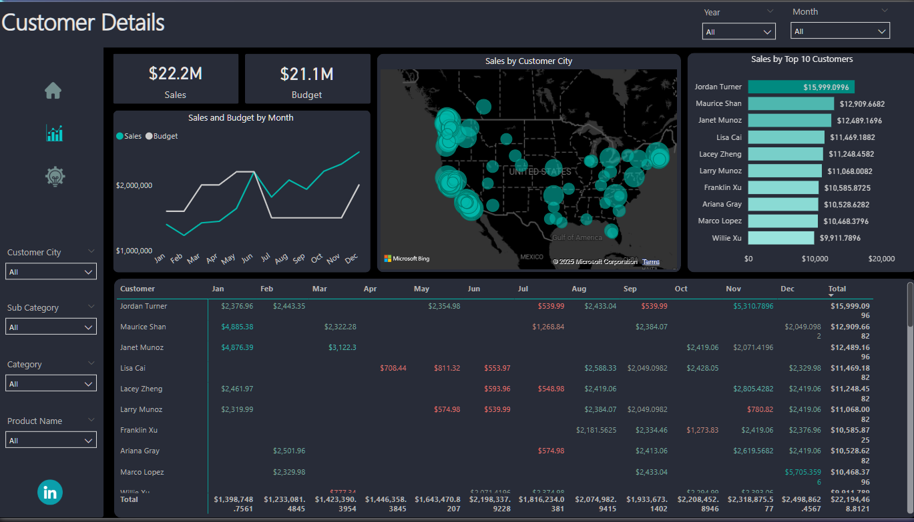

# Enhancing Internet Sales Reporting with Interactive Dashboards

## Introduction
Businesses thrive on customer insights, sales patterns, and product performance metrics. However, raw data alone is not enough, it must be transformed into meaningful visual stories. This Power BI project is an effort to do just that: take scattered sales, customer, and product data and turn it into an interactive, insightful dashboard.
This project aims to showcase how Power BI can be leveraged to create a data-driven approach for business decisions. The focus is on analyzing customer behavior, sales trends, and product performance, helping businesses make informed strategic moves.

## About the Dataset
The dataset used in this project consists of three primary components:
1.	Customer Data: Includes demographics, customer ID, and location details.
2.	Sales Data: Contains transaction records, purchase amounts, dates, and related metrics.
3.	Product Data: Covers product categories, prices, and stock information.
   
These datasets are integrated to build a comprehensive view of business operations, focusing on revenue trends, customer preferences, and high-performing products.

## Problem Statement
 Sales Manager:
 
Hi James,

I hope you're doing well. We need to enhance our internet sales reports by transitioning from static reports to interactive visual dashboards.
Our main focus is to analyze how much we've sold, which products were sold, who our clients are, and how sales have evolved over time. Since each salesperson handles different products and customers, it would be helpful to have filtering options.
We also track our performance against the budget, so I’ve included a spreadsheet with budget data for comparison. The budget is for 2021, and we typically analyze sales data from the past two years.
Let me know if you need any additional details!

This project aims to solve these challenges using Power BI’s advanced visualization and analytical capabilities.

## Power BI Concept
- Data Modeling: Connecting multiple data sources and defining relationships.
-	DAX (Data Analysis Expressions): Used for creating custom metrics and KPIs.
-	Interactive Visualizations: Dynamic charts, graphs, and slicers for real-time filtering.

## Data Transformation

Before visualizing the data, key steps in Power Query included:
- Data cleaning (handling missing values, duplicates, and formatting inconsistencies)
- Creating calculated columns and measures using DAX
- Aggregating sales data for time-based trends

## Data Model

The project follows a star schema data model, ensuring efficient query performance. 

  

The main components include:

- Fact Table: Sales transactions, capturing key metrics like revenue, quantity sold, and profit.
- Dimension Tables: Customers, Products, and Date tables, allowing multi-dimensional analysis.
- Relationships: Established between tables to facilitate seamless report generation.
  

## Report

The Power BI report contains multiple pages, each focusing on a specific business insight:
- Sales Overview: A high-level summary of revenue, transactions, and trends.
- Customer Insights: Breakdown of purchases by demographics and regions.
- Product Performance: Analysis of top-selling products and categories.
- Time-Based Trends: Monthly, quarterly, and yearly sales analysis.
- Geographical Analysis: Sales distribution across different locations.

 

 

 

 [Interact with Dashboard here](https://app.powerbi.com/view?r=eyJrIjoiNjlkYmIzN2MtYjhkNC00ZWE5LTk1ODItYzU3MDJjODBlOWEwIiwidCI6IjZiYjI1Yjk2LTlhZTItNDkxMy1hZTYxLThmOGE3NDNjYTY5NiJ9)

  
## Dashboard Features

The dashboard is designed to be user-friendly and interactive, featuring:
- Dynamic Filters & Slicers: Allow users to analyze data by region, time period, and product category.
- KPI Cards: Showcasing total revenue, customer count, and top-selling products.
- Drill-Through Capability: Users can click on a specific data point to get deeper insights.
- Maps & Trend Lines: Visualizing sales patterns over time.
  
## Conclusions 

From the analysis, several key insights emerged:
- Customer Segmentation: Young professionals contribute the most to revenue, and targeted marketing can further enhance sales.
- Product Optimization: Certain product categories outperform others, indicating where inventory should be prioritized.
- Regional Trends: Sales are higher in urban areas, suggesting potential for regional promotions.
- Seasonality: Peaks in sales during certain months highlight opportunities for strategic pricing and discounts.
  
## Recommendations:

1.	Implement personalized marketing campaigns based on customer purchase behavior.
2.	Optimize stock management for high-demand products to prevent stockouts.
3.	Expand sales efforts in high-performing regions while addressing gaps in low-performing areas.
4.	Continuously monitor sales trends and adjust strategies based on Power BI insights
